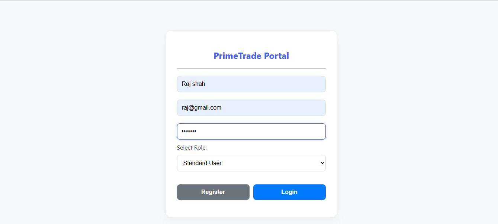
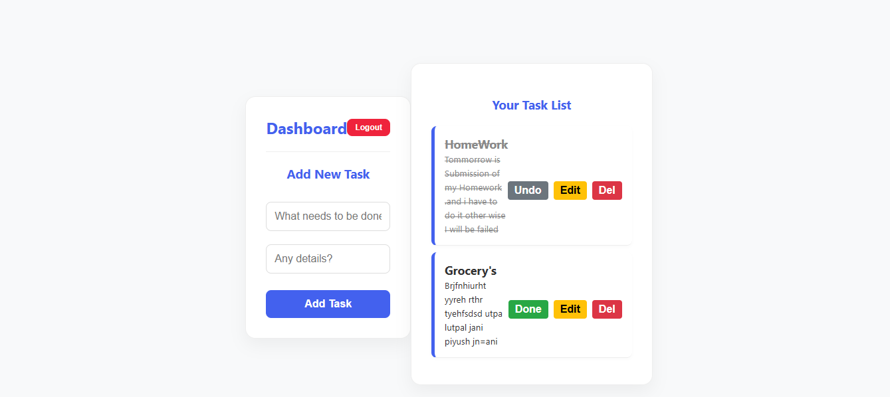

# PrimeTrade Task Management Portal 

A comprehensive Full-Stack Task Management System featuring a secure RESTful API backend and a dynamic, responsive frontend. This project demonstrates professional-grade software architecture, role-based security, and seamless CRUD operations.

## 🛠️ Tech Stack
Component  Technology 

**Backend** Python, Flask, Flask-SQLAlchemy 
**Security** JWT (JSON Web Tokens), Bcrypt Hashing 
**Database** SQLite (Production-ready for PostgreSQL) 
**Frontend**  Vanilla JavaScript (ES6+), HTML5, CSS3 (Modern UI) 

SQLite-"Development uses SQLite for ease of evaluation. However, the project is built with SQLAlchemy ORM, making it fully compatible with PostgreSQL/MySQL for production scaling."

## Project WalkThrough
### 1. Secure Authentication
 

### 2. Interactive Dashboard

## ✨ Core Features
- **User Authentication:** Secure registration and login with encrypted passwords.
- **JWT Authorization:** Protected API endpoints ensuring only logged-in users can access their data.
- **Role-Based Access Control (RBAC):** - `User`: Can manage their own tasks.
  - `Admin`: Full visibility over the system (scalable for management).
- **Responsive UI:** Clean dashboard design for all screen sizes.
- **Advanced CRUD Engine:**
  - **Create:** Add tasks with titles and descriptions.
  - **Read:** Real-time fetching and display of task lists.
  - **Update:** Inline editing and one-tap status toggles (Pending/Completed).
  - **Delete:** Fast removal of task records with confirmation.

## 🚀 Scalability & Architecture
- **Modular Design:** Built using Flask Blueprints for independent module management.
- **API Versioning:** Structured routes for future-proofing integrations.
- **Scalability Path:** Ready for Docker containerization, Redis caching, and PostgreSQL migration for high-traffic environments.

## 🏃 Setup Instructions
1. **Clone Repo:** `git clone https://github.com/Utpaljani20/Prime-trade-task-Management.git`
2. **Install Deps:** `pip install -r requirements.txt`
3. **Run Server:** `python run.py`
4. **Access:** `http://127.0.0.1:5000/`

---
*Developed for the Primetrade.ai Backend Developer Internship Assignment.*